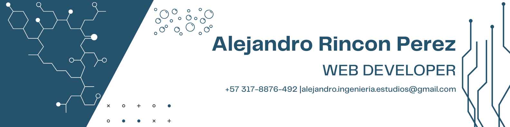
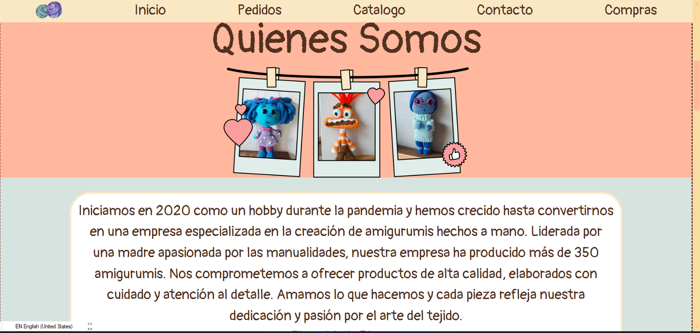
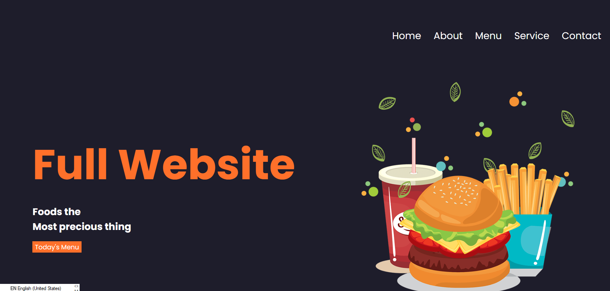

#  <picture>   </picture>Alejandro Rincon 

## <picture></picture> About me

👨‍💻 &nbsp;I am currently working as a Backend Developer.  
💡 &nbsp;I enjoy exploring new technologies and creating software solutions tailored to users' needs.  
🎓 &nbsp;I am continuously learning to expand my expertise in Web3, Microservice-Based Architecture, and Machine Learning.  
🌱 &nbsp;My focus on logic and technical knowledge drives me to continuously improve and adapt in every project I work on.  
✍️ &nbsp;In my free time, I enjoy logo design and blog writing as creative outlets.  
💬 &nbsp;Collaboration and communication are my strengths, and I value teamwork in achieving impactful results.  
📬 &nbsp;Feel free to email me! I’m always open to meaningful discussions, volunteering, and pro bono consulting.  

## 🛠️ My Skills

###  </picture> Programming Languages

 
  &emsp;
  
  &emsp;
  
  &emsp;
  
  &emsp;
  
  &emsp;
  

### Frontend Development

 
  &emsp;
  
  &emsp;
  
  &emsp;
  

### Software & Tools

 
  &emsp;
  
  &emsp;

  
  &emsp;
  
  &emsp;
  

###  IDEs

 
  &emsp;
  
  &emsp;
  

## 📁 Projects

  <!-- Proyecto Amigurumis -->
  

    
    

      <a href="https://alejandrorinconperez.github.io/Amigurumins_Proyecto_Personal/#Inicio" target="_blank">Visit Project</a>
    

    

      This is a personal project designed to showcase a handcrafted product: earrings made with amigurumi techniques. The project highlights the creative and artistic process, aiming to introduce the uniqueness of handmade jewelry to the public.
    

  

  <!-- Sistema Parquedero -->
  

    
    

      <a href="https://alejandrorinconperez.github.io/Proyecto_JavaScript_AlejandroRinconPerez/" target="_blank">Visit Project</a>
    

    

      This project is a parking management system that allows the easy entry and exit of vehicles. It aims to provide an intuitive and well-organized interface for managing parking spaces, making it simpler for users to find available spots and manage vehicle movements.
    

  

  <!-- Hamburgueseria -->
  

    
    

      <a href="https://alejandrorinconperez.github.io/Pagina_Hambuerguesas_Alejnadro/" target="_blank">Visit Project</a>
    

    

      This project serves as a reflection of my front-end development skills. It is a landing page for a fictional hamburger restaurant, created with a focus on user experience and responsive design, offering an engaging and visually appealing interface.
    

  

## 🚀 Learning Path
- Began my journey with **Python** to understand programming fundamentals and problem-solving.  
- Gained experience in **HTML** and **JavaScript**, focusing on front-end development and creating interactive user interfaces.  
- Expanded my skills in **SQL** for database management and efficient querying.  
- Explored **Java** for building robust and scalable applications.  
- Learned **PostgreSQL**, diving deeper into advanced relational database concepts.  
- Currently mastering **Spring Boot** to develop microservice-based back-end applications.

## 📊 GitHub Stats

  
   
  

## 🚀 Keep Coding!

